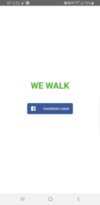
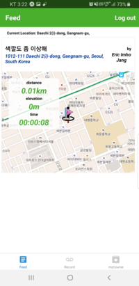
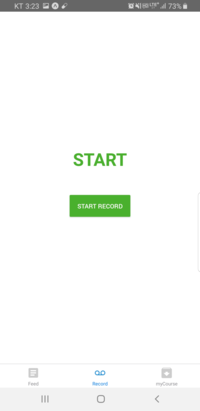
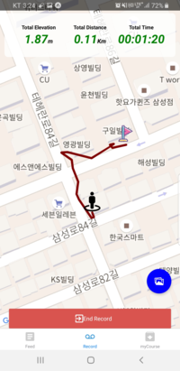
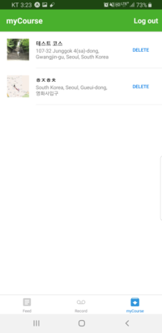

# WEWALK
## introduction
WEWALK는 자신의 산책 코스와 이미지를 함께 업로드하여 기록하고, 공유하는 안드로이드 어플리케이션입니다.








## Content
- [Requirements](#Requirements)
- [Installation](#Installation)
- [Features](#Features)
- [Skills](#Skills)
- [Test](#Test)
- [Deployment](#Deployment)
- [Project Control](#Project-Control)
- [Version Control](#Version-Control)
- [Challenges](#Challenges)
- [Things To Do](#Things-To-Do)
- [Sincere Thanks](#Sincere-Thanks)

## Requirements
- 안드로이드 기반 모바일 기기에서 사용할 수 있습니다.
- Facebook API를 사용했습니다. Facebook 계정이 있어야 로그인이 가능합니다.

### Client

```sh
git clone https://github.com/CyranoPark/wewalk-app.git
cd wewalk-app
npm install
expo start
```

### Server

```sh
git clone https://github.com/CyranoPark/wewalk-server.git
cd wewalk-server
npm install
npm start
```

## Features

- Facebook을 이용한 로그인 기능
- JSON Web Token Authentication
- 현재 위치 기준 가까운 순서로 피드 노출
- 다른 이용자의 산책코스를 지도로 확인
- 산책 경로를 지도에 라인으로 표시
- 사용자 디바이스의 카메라, 사진첩 이용 이미지 업로드
- 자신이 작성한 산책 경로 수정 및 삭제

## Skills
### Client-Side

- React Native
- Expo
- React-redux
- React Navigation
- native base

### Server-Side

- Node.js
- Express
- JSON Web Token Authentication
- MongoDB
- Mongoose
- AWS S3

## Test
### Client-Side
- Jest
- Enzyme

```sh
npm test
```

### Server-Side
- Mocha
- Chai
- Chai-http

```sh
npm test
```

## Deployment

### Client
- Google Play Store
- [WEWALK APP](https://play.google.com/store/apps/details?id=com.vaco.wewalk)

### Server
- circleci (CI)
- AWS Elastic Beanstalk

## Project Control
- Git Branch 기반 개발 진행
- Notion를 이용한 Task Management

## Version Control
- GIT repository

## Challenges
- React Native 관련하여 최초 세팅 과정에서 시간이 많이 소요되었다. 이 때문에 전체 스케줄 조정이 어려웠다. 불필요한 일정을 뒤로 빼거나 간략히 진행하면서 해결하였다.(코스 상세 스크린의 코멘트 및 좋아요 기능 등)
- Navigation 과 Redux 사용을 함께하는 데 Props를 넘겨주는 구조를 설정하는 것이 어려웠다. App Navigator를 App Container로 만들어 connect 시키고 Props는 Screen Prop으로 내려주는 방식으로 해결하였다.
- Screen과 Component 사이의 차이점이 불명확하게 되었다. Component는 재사용이 가능하게 만들기 위해서 각각의 Props들을 화면에 렌더링 시키는 목적으로 만들었고, Screen은 각 Component에 Props들을 내려주는 역할을 하였다.

## Things-To-Do
- 코스 상세페이지의 댓글, 좋아요 기능
- 걷는 속도 표시 기능
- 기록 중단/재시작 기능
- 백그라운드 구동 표시 기능
- ios 버전 개발

## Sincere Thanks
[Ken Huh](https://github.com/ken123777 "ken huh") / Vanilla Coding
